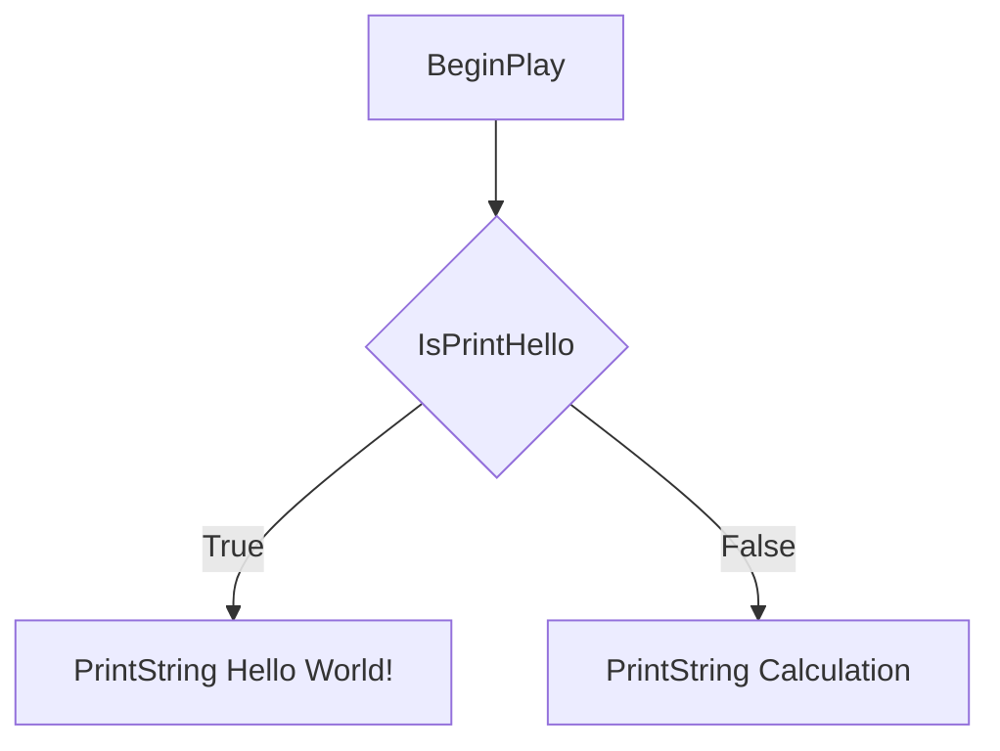

## 【Blueprint版】Flow Control(Branch)

「もし、あの時○○をしていたら。。。」

「選択肢1～4のどれかを選択しなさい。」

常に選択を迫られています。
プログラミンでは分岐する処理を実装することができます。
今回は、Floｗ Control(制御文)について学習します。

### 今回出来ること
変数の値に応じて、PrintStringを切り替えて出力します。

### 学習用の新規レベル「Chapter_2_FlowControl_Branch」を作成する

学習用の新規レベルを作成します。
[File]から[New Level…]を選択します。

[Default]を選択します。

「Maps」フォルダに「Chapter_2_FlowControl_Branch」を入力し、[Save]ボタンをクリックします。

### Blueprintを複製する

「BP_SampleActor」を複製(Ctrl + W)して、「BP_FlowControl_Branch」を作成します。

### Flow Controlに使用する変数を宣言する
今回使用する変数を宣言します。

| VariableName | VariableType | Category     | DefaultValue |
| ------------ | ------------ | ------------ | ------------ |
| IsPrintHello | Boolean      | Flow Control | true         |
| CalcType     | Integer      | Flow Control | 0            |
| NumA         | Integer      | Flow Control | 1            |
| NumB         | Integer      | Flow Control | 2            |
| NumC         | Integer      | Flow Control | 15           |

### Branchノードで処理を切り替える
[Branch]ノードを使用して、「Hello Wordl!」を出力するPrintStringと、計算結果をPrintStringする処理を切り替えます。

Sequenceノードの[Then 0]実行ピンと「Hello World!」を出力する[PrintString]ノードの実行ピンの接続を解除します。
[Branch]ノードを追加します。

変数[IsPrintHello]のGetノードを追加し、[Branch]ノードの[Condition]ピンに接続します。
[Branch]ノードを図のように実行されるように実行ピンを接続します。

[Compile]ボタンをクリックします。

LevelEditorに移動し、「BP_FlowControl_Branch」をViewportにDrag&Dropします。

[Play]ボタンをクリックします。

「Hello World!」を出力する[PrintString]ノードの処理のみが実行されました。

Playボタンを押した時にBlurprintEditorを表示しておくと、Blueprintがどのような動きをしているか確認できます。

[Branch]ノードは[Condition]ピンに接続したノードの値に応じて、実行される実行ピンが切り替わります。
今回は変数[IsPrintHello]に[True]の値が設定されていたので、[Branch]ノードは[True]の実行ピンに処理を切り替えて、[Hello World!]を出力する[PrintString]ノードを実行しました。

### 比較演算子ノードで処理を切り替える
2つの変数[NumA]と[NumB]の値を比較して分岐するように変更します。

変数[NumA]と変数[NumB]が一致しているかを比較して、その結果を[Branch]ノードの[Condition]ピンに接続します。

比較演算子ノードを追加する時は、比較演算子で検索し、図のノードコメントをメニューから選択します。
後ほど、比較演算子の一覧を載せましたので有効活用してください。

[Compile]ボタンをクリックします。

[Play]ボタンをクリックします。

計算結果のPrintStringが出力されました。

変数[NumA]の値は[1]、変数[NumB]の値は[2]なので、一致しません。
[Branch]ノードは[False]の実行ピンに処理を切り替えて、計算結果を出力する[PrintString]ノードを実行しました。

比較演算子は「一致している(Equal)」以外にも用意されています。
一覧を用意しましたので、有効活用してください。

| 検索Word | Menu項目      | Blueprint                                                                                            | 数式 | 読み方     | 使い方 | 意味             |
| -------- | ------------- | ---------------------------------------------------------------------------------------------------- | ---- | ---------- | ------ | ---------------- |
| ==       | Equal         |  | =    | 等しい     | A==B   | AとBは等しい     |
| <        | Less          |  | <    | 小なり     | A<B    | AはBより小さい   |
| >        | Greater       |  | ＞   | 大なり     | A>B    | AはBより大きい   |
| <=       | Less Equal    |  | ≦    | 以下       | A<=B   | AはB以下         |
| >=       | Greater Equal |  | ≧    | 以上       | A>=B   | AはB以上         |
| !=       | Not Equal     |  | ≠    | 等しくない | A!=B   | AとBは等しくない |

### 論理演算子ノードで処理を切り替える

変数NumCが「10より大きく、30以下」のような範囲内かどうかで分岐させます。
[AND]と書かれたノードは[AND Boolean]と検索して追加してください。

「Make Literal Int」は変数を作成せずに、VariableType(変数の型)の値を使いたい時に使用するノードです。
「Make Literal (VariableType)」をメニューから選択します。
「Make Literal (VariableType)」のValueに値を設定します。

[Compile]ボタンをクリックします。

[Play]ボタンをクリックします。

「Hello World!」を出力する[PrintString]ノードの処理のみが実行されました。

今回は変数[NumC]に[15]の値が設定されていたので、「10<NumC(15)」と[NumC(15)<30]の条件が両方ともTrueだったので、[AND Boolean]ノードは[True]になります。
[Branch]ノードは[True]の処理に切り替えて、[Hello World!]を出力する[PrintString]ノードを実行しました。

[AND Boolean]のように複数の条件を組み合わせて、より複雑な条件を表すときに使うのが**論理演算子**です。
論理演算子は「AND Boolean」以外にも用意されています。
一覧を用意しましたので、有効活用してください。

| 検索Word    | Menu項目    | Blueprint                                                                                            | 読み方     | 使い方         | 意味                |
| ----------- | ----------- | ---------------------------------------------------------------------------------------------------- | ---------- | -------------- | ------------------- |
| AND Boolean | AND Boolean |  | かつ       | 1<=a&&a<=5 | aは1以上かつ5以下 |
| OR Boolean  | OR Boolean  |  | または     | a==1\|\|a==2  | Aの値が1または2     |
| Not Boolean | Not Boolean |  | ～ではない | !(a==1)        | Aは1ではない        |

論理演算子はこの3種類以外にも用意されています。
興味があれば調べてみてください。

### 複数の選択肢で分岐する

変数[CalcType]の数値で計算結果を1つだけPrintStringで出力するように変更します。

DefaultValueを変更して、引き算のPrintStringが出力されるように変更します。
| VariableName | VariableType | Category     | DefaultValue |
| ------------ | ------------ | ------------ | ------------ |
| IsPrintHello | Boolean      | Flow Control | false        |
| CalcType     | Integer      | Flow Control | 1            |

図のように[Branch]ノードを追加して処理を切り分けてください。

[Compile]ボタンをクリックします。

[Play]ボタンをクリックします。

引き算の結果が表示されます。

変数[IsPrintString]が[False]なので、最初の[Branch]ノードは[False]の実行ピンを実行します。
次の[Branch]ノードでは、変数[CalcType]と値が一致していないので[False]の実行ピンを実行します。
次の[Branch]ノードでは、変数[CalcType]と値が一致するので、引き算の[PrintString]ノードが実行されます。
[Branch]ノードを複数組み合わせることで、複数の選択肢に分岐することができます。

### 全て保存してBlueprint側は終了です。
Blueprint側の説明は以上になります。
プロジェクトを全て保存しましょう。

