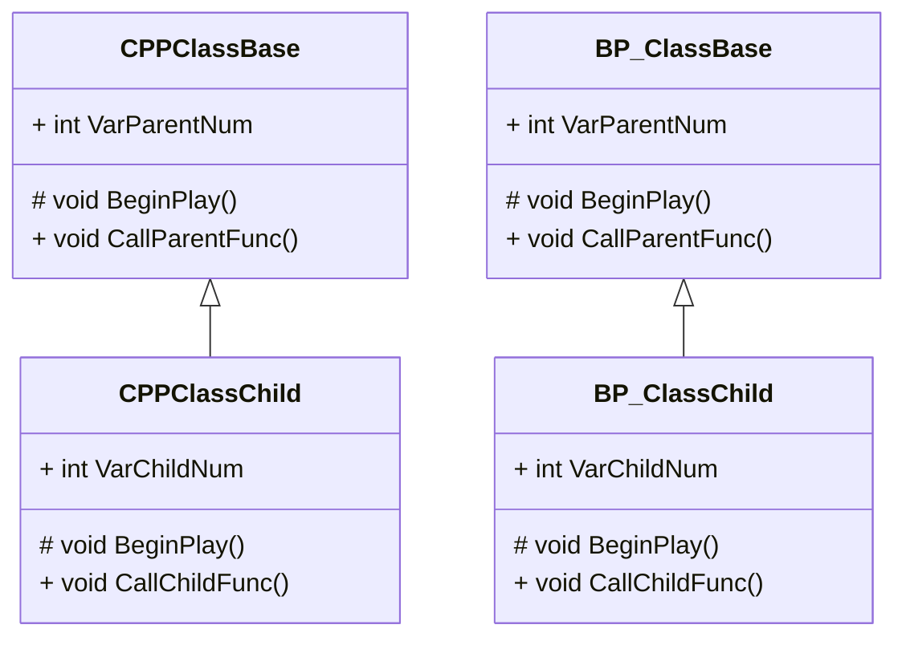

## 継承

### 継承について

派生クラスは基底クラスのデータメンバーやメンバ関数を含めることができました。
BlueprintでもC++と同様の構成で基底クラスと派生クラスを作成して処理を確認します。

## Blueprintの継承

それではBlueprintで基底クラスと派生クラスを作成してみます。

### 基底クラスの作成

基底クラスのBlueprintを作成します。

親クラスに[Actor]を選択します。

名前を「BP_ClassBase」に設定します。

変数を追加します。

| VariableName | VariableType | DefaultValue |
| ------------ | ------------ | ------------ |
| VarParentNum | Integer      | 20           |

関数「CallParentFunc」を追加し、処理を実装します。

「Event Begin Play」で「CallParentFunc」を呼び出します。

「StaticMesh」Componentを追加します。

「StaticMesh」ComponentのStaticMeshに「Cube」を設定します。

Materialには2章で作成したマテリアルを設定します。

[Compile]ボタンをクリックします。

「BP_ClassBase」をViewportに配置します。

Level Editorの[Play]ボタンをクリックします。

### 派生クラスの作成

派生クラスを作成します。

親クラスに[BP_ClassBase]を選択します。
継承したいクラスを指定する場合は、[All Classes]からクラス名を検索して選択し、[Select]ボタンをクリックします。

名前を「BP_ClassChild」に設定します。

Blueprintの派生クラスは基底クラスを「右クリック」 > 「Create Child Blueprint Class」 でも作成できます。
同フォルダ内に派生クラスを作るのであれば、コチラの手順の方が早いです。

変数を追加します。

| VariableName | VariableType | DefaultValue |
| ------------ | ------------ | ------------ |
| VarChildNum  | Integer      | 200          |

関数[CallChildFunc]を追加し、処理を実装します。

Begin Playで[CallChildFunc]を呼び出します。

Componentの[StaticMesh]のStaticMeshプロパティに[Sphere]を設定します。
Componentは基底クラスで追加したStaticMeshが派生クラスに継承されているので、派生クラスを作った際に追加されています。

[Compile]ボタンをクリックします。

「BP_ClassChild」Viewportに配置します。
「BP_ClassBase」を削除します。

Level Editorの[Play]ボタンをクリックします。

基底クラスの関数[CallParentFunc]が呼ばれた後に、関数[CallChildFunc]が呼ばました。

この時の処理の順序は以下のようになります。
BlueprintもC++の「Super」同様に基底クラスの同じ名前の関数を呼び出すノードが用意されています。

C++の時と同じ順序で処理をしています。

### 基底クラスのメンバ関数呼び出し

派生クラスは基底クラスの持つメンバ関数を呼び出すことができます。
Parentノードの接続を外し、基底クラスのメンバ関数「CallParentFunc」を呼び出してから、メンバ関数「CallChildFunc」を呼び出すように修正します。

[Compile]ボタンをクリックします。

Level Editorの[Play]ボタンをクリックします。

基底クラスのメンバ関数「CallParentFunc」を呼びだせることが確認できました。

### 基底クラスのデータメンバの変更

基底クラスのデータメンバを変更します。

[Compile]ボタンをクリックします。

Level Editorの[Play]ボタンをクリックします。

基底クラスのデータメンバの値を変更できました。

Blueprintでは基底クラスのデータメンバのDefault値をUIで変更できます。
[ClassDefault]ボタンをクリックすると、[Details]パネルに変数の一覧が表示されます。
基底クラスのデータメンバである[VarParentNum]のDefault値を変更します。
Default値の変更を確認するためにSetノードの接続を外します。

[Compile]ボタンをクリックします。

Level Editorの[Play]ボタンをクリックします。

[Class Default]で変更したDefault値が反映されました。
Blueprintでは基底クラスで宣言したデータメンバの値を派生クラスでUIから変更できるので非常に分かりやすいです。

### 基底クラスからは派生クラスで定義したデータメンバ、メンバ関数は使用できない

基底クラス「BP_ClassBase」を開きます。

派生クラスのデータメンバ「VarChildNum」を検索しますが、検索欄には見つかりません。

派生クラスのメンバ関数「CallChildFunc」を検索しますが、検索欄には見つかりません。

派生クラスでは基底クラスのデータメンバ、メンバ関数を使用できます。
基底クラスでは派生クラスのデータメンバ、メンバ関数を使用できません。

