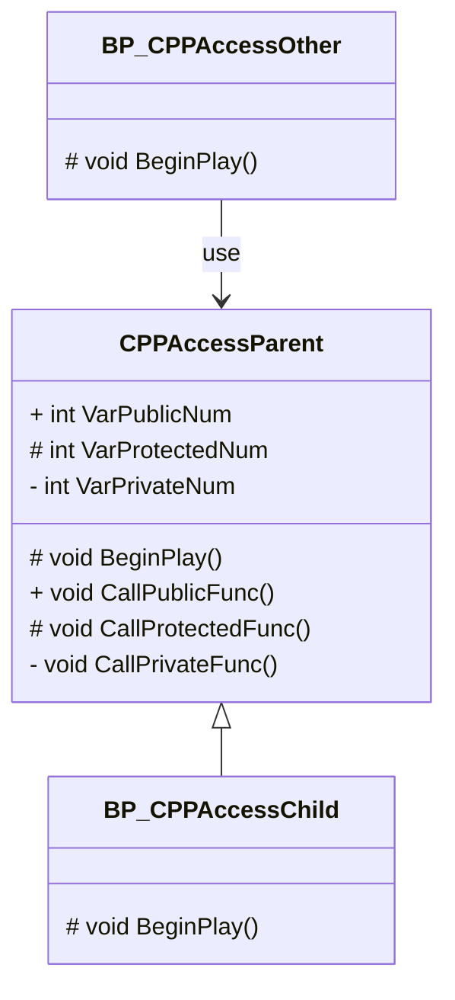

## アクセス指定子

### アクセス指定子について

継承した派生したクラスが基底クラスのデータメンバやメンバ関数を使用できました。
アクセス指定子によってメンバを参照できる範囲を制限できます。
アクセス指定子には次の3種類があります。

| アクセス指定子 | 自クラス | 継承したクラス | 外部クラス |
| -------------- | -------- | -------------- | ---------- |
| public         | 〇       | 〇             | 〇         |
| protected      | 〇       | 〇             | ×          |
| private        | 〇       | ×              | ×          |

C++の基底クラスを継承したBlueprintで3つのアクセス指定子の使用方法や参照できる範囲を把握してみます。



### 派生クラスを作成する

C++で作成した「CPPAccessParent」からBlueprintの派生クラスを作成します。
「CPPAccessParent」を右クリック > [Create Blueprint class based on CPPAccessParent]を選択します。


名前を「BP_CPPAccessChild」に設定 > 作成するフォルダを選択 > [Create Blueprint Class]を選択します。


作成したBlueprintのEvent Graphで基底クラスのメンバ関数を選択しても一覧に見つかりません。


同じく、基底クラスのデータメンバを検索しても一覧に見つかりません。


### C++の基底クラスをBlueprintから参照できるようにする

C++の基底クラスからデータメンバやメンバ関数をBlueprintで参照するにはUPROPERTYとUFUNCTIONを宣言します。
すべてのデータメンバとメンバ関数にUPROPERTYとUFUNCTIONを宣言します。

```cpp:CPPAccessParent.h
// Fill out your copyright notice in the Description page of Project Settings.

#pragma once

#include "CoreMinimal.h"
#include "GameFramework/Actor.h"
#include "CPPAccessParent.generated.h"

UCLASS()
class CPP_BP_API ACPPAccessParent : public AActor
{
	GENERATED_BODY()
	
protected:
	// Called when the game starts or when spawned
	virtual void BeginPlay() override;

public:
	
	// 親クラスのメンバ関数(Public)
	UFUNCTION(BlueprintCallable, Category = CPP_And_Blueprint)
	void CallPublicFunc();

	// 親クラスのデータメンバ(Public)
	UPROPERTY(EditAnywhere, BlueprintReadWrite, Category = Default)
	int VarPublicNum = 10;

protected:

	// 親クラスのメンバ関数(Protected)
	UFUNCTION(BlueprintCallable, Category = CPP_And_Blueprint)
	void CallProtectedFunc();

	// 親クラスのデータメンバ(Protected)
	UPROPERTY(EditAnywhere, BlueprintReadWrite, Category = Default)
	int VarProtectedNum = 20;

private:

	// 親クラスのメンバ関数(Private)
	UFUNCTION(BlueprintCallable, Category = CPP_And_Blueprint)
	void CallPrivateFunc();

	// 親クラスのデータメンバ(Private)
	UPROPERTY(EditAnywhere, BlueprintReadWrite, Category = Default)
	int VarPrivateNum = 30;
};
```

ソースコードを保存して、Compileを実行します。


privateで宣言しているデータメンバ「VarPrivateNum」のBlueprintReadWriteの設定でエラーが発生します。

```
CPP_BP/Source/CPP_BP/Public/CPPAccessParent.h(45): Error: BlueprintReadWrite should not be used on private members
Build failed.
```

UPROPERTYのBlueprintReadWriteを削除します。

```
	// 親クラスのデータメンバ(Private)
	UPROPERTY(EditAnywhere, BlueprintReadWrite, Category = Default)
	int VarPrivateNum = 30;

	↓

	// 親クラスのデータメンバ(Private)
	UPROPERTY(EditAnywhere, Category = Default)
	int VarPrivateNum = 30;
```

ソースコードを保存して、Compileを実行します。


データメンバを一覧から検索すると、Private以外のデータメンバを参照できます。


メンバ関数を一覧から検索すると、すべてのアクセス指定子のメンバ関数が参照できます。


参照できるデータメンバ、メンバ関数を参照する処理を実装します。


UPROPERTYにEditAnywhereを設定しているので、Privateに設定しているデータメンバもClass Defaultから設定を変更できます。


[Compile]ボタンをクリックします。


Viewportに「BP_CPPAccesssChild」をDrag&Dropします。


Level Editorの[Play]ボタンをクリックします。


データメンバのPrivate以外はノードが作れます。


### アクセス指定子Privateの処理を正しくする

UPROPERTY、UFUNCTIONの設定次第でアクセス指定子とは違った処理を実行できます。
アクセス指定子の「Private」は自クラスのみ参照できるのが正しい動きなので、UPROPERTY、UFUNCTIONを外して正しい動きにします。

```cpp:CPPAccessParent.h
// Fill out your copyright notice in the Description page of Project Settings.

#pragma once

#include "CoreMinimal.h"
#include "GameFramework/Actor.h"
#include "CPPAccessParent.generated.h"

UCLASS()
class CPP_BP_API ACPPAccessParent : public AActor
{
	GENERATED_BODY()
	
protected:
	// Called when the game starts or when spawned
	virtual void BeginPlay() override;

public:
	
	// 親クラスのメンバ関数(Public)
	UFUNCTION(BlueprintCallable, Category = CPP_And_Blueprint)
	void CallPublicFunc();

	// 親クラスのデータメンバ(Public)
	UPROPERTY(EditAnywhere, BlueprintReadWrite, Category = Default)
	int VarPublicNum = 10;

protected:

	// 親クラスのメンバ関数(Protected)
	UFUNCTION(BlueprintCallable, Category = CPP_And_Blueprint)
	void CallProtectedFunc();

	// 親クラスのデータメンバ(Protected)
	UPROPERTY(EditAnywhere, BlueprintReadWrite, Category = Default)
	int VarProtectedNum = 20;

private:

	// 親クラスのメンバ関数(Private)
	void CallPrivateFunc();

	// 親クラスのデータメンバ(Private)
	int VarPrivateNum = 30;
};
```

ソースコードを保存して、Compileを実行します。


Privateで宣言したメンバ関数[CallPrivateFunc]がエラーになるので削除します。
Class DefaultからPrivateのデータメンバ[VarPrivateNum]が表示されなくなり設定できなくなります。
これで、アクセス指定子「Private」として正しい実装になります。


[Compile]ボタンをクリックします。


Level Editorの[Play]ボタンをクリックします。


派生クラスから、Privateで宣言したデータメンバ、メンバ関数を参照できなくなり、PublicとProtectedが参照できるようになります。


### BPの外部クラスからC++のクラスを参照する

BlueprintからC++のクラスを参照する外部クラスを作成します。


親クラスに[Actor]を選択します。


名前を「BP_CPPAccessOther」に設定します。


「Get Actor Of Class」で[CPPAccessParent]を取得し、データメンバのSetを検索します。
外部クラスからはアクセス指定子が「Public」のデータメンバしか参照できないはずですが、UPROPERTYにBlueprintReadWriteが定義されていると「Protected」でも参照できてしまいます。


メンバ関数も外部クラスからはアクセス指定子が「Public」のメンバ関数しか参照できないはずですが、UFUNCTIONにBlueprintCallableが定義されていると「Protected」でも参照できてしまいます。


アクセス指定子がPublicとProtectedのデータメンバとメンバ関数に参照する処理を実装します。


[Compile]ボタンをクリックします。


Viewportの「BP_CPPAccessChild」を削除し、「BP_CPPAccessOther」をDrag&Dropします。


「BP_CPPAccessOther」から参照するために「CPPAccessParent」をDrag&Dropします。


Level Editorの[Play]ボタンをクリックします。


PublicとProtectedのアクセス指定子が参照できました。
外部クラスからでもProtectedのアクセス指定子が呼べてしまいます。


### パッケージ化の際のエラー修正をする

Protectedのアクセス指定子は自クラスと派生クラスしか参照できないので、本来のアクセス指定子の動きとは違います。
エディタでは動いてしまいますが、パッケージ化をした時にエラーが発生します。

Windowsでパッケージ化を行います。


パッケージ化が失敗してしまいます。
エラーの内容がProtectedのデータメンバ、メンバ関数でエラーが発生します。
Protectedのエラーに伴いPublicのアクセス指定子のデータメンバ、メンバ関数でもエラーが発生しています。


```
UATHelper: Packaging (Windows): LogBlueprint: Error: [AssetLog]\CPP_BP\Content\CPP_BP\Blueprints\BP_CPPAccessOther.uasset: [Compiler] In use pin  <Unnamed>  no longer exists on node  Call Protected Func . Please refresh node or break links to remove pin. from Source: /Game/CPP_BP/Blueprints/BP_CPPAccessOther.BP_CPPAccessOther
UATHelper: Packaging (Windows): LogBlueprint: Error: [AssetLog]\CPP_BP\Content\CPP_BP\Blueprints\BP_CPPAccessOther.uasset: [Compiler] In use pin  Target  no longer exists on node  Call Protected Func . Please refresh node or break links to remove pin. from Source: /Game/CPP_BP/Blueprints/BP_CPPAccessOther.BP_CPPAccessOther
UATHelper: Packaging (Windows): LogBlueprint: Error: [AssetLog]\CPP_BP\Content\CPP_BP\Blueprints\BP_CPPAccessOther.uasset: [Compiler] Could not find a function named "CallProtectedFunc" in 'CPPAccessParent'.
UATHelper: Packaging (Windows): Make sure 'CPPAccessParent' has been compiled for  Call Protected Func from Source: /Game/CPP_BP/Blueprints/BP_CPPAccessOther.BP_CPPAccessOther
UATHelper: Packaging (Windows): LogBlueprint: Error: [AssetLog]\CPP_BP\Content\CPP_BP\Blueprints\BP_CPPAccessOther.uasset: [Compiler] In use pin  <Unnamed>  no longer exists on node  Call Public Func . Please refresh node or break links to remove pin. from Source: /Game/CPP_BP/Blueprints/BP_CPPAccessOther.BP_CPPAccessOther
UATHelper: Packaging (Windows): LogBlueprint: Error: [AssetLog]\CPP_BP\Content\CPP_BP\Blueprints\BP_CPPAccessOther.uasset: [Compiler] In use pin  <Unnamed>  no longer exists on node  Call Public Func . Please refresh node or break links to remove pin. from Source: /Game/CPP_BP/Blueprints/BP_CPPAccessOther.BP_CPPAccessOther
UATHelper: Packaging (Windows): LogBlueprint: Error: [AssetLog]\CPP_BP\Content\CPP_BP\Blueprints\BP_CPPAccessOther.uasset: [Compiler] In use pin  Target  no longer exists on node  Call Public Func . Please refresh node or break links to remove pin. from Source: /Game/CPP_BP/Blueprints/BP_CPPAccessOther.BP_CPPAccessOther
UATHelper: Packaging (Windows): LogBlueprint: Error: [AssetLog]\CPP_BP\Content\CPP_BP\Blueprints\BP_CPPAccessOther.uasset: [Compiler] Could not find a function named "CallPublicFunc" in 'CPPAccessParent'.
UATHelper: Packaging (Windows): Make sure 'CPPAccessParent' has been compiled for  Call Public Func from Source: /Game/CPP_BP/Blueprints/BP_CPPAccessOther.BP_CPPAccessOther
PackagingResults: Error: [AssetLog]\CPP_BP\Content\CPP_BP\Blueprints\BP_CPPAccessOther.uasset: [Compiler] In use pin  <Unnamed>  no longer exists on node  Call Protected Func . Please refresh node or break links to remove pin. from Source: /Game/CPP_BP/Blueprints/BP_CPPAccessOther.BP_CPPAccessOther
PackagingResults: Error: [AssetLog]\CPP_BP\Content\CPP_BP\Blueprints\BP_CPPAccessOther.uasset: [Compiler] In use pin  Target  no longer exists on node  Call Protected Func . Please refresh node or break links to remove pin. from Source: /Game/CPP_BP/Blueprints/BP_CPPAccessOther.BP_CPPAccessOther
PackagingResults: Error: [AssetLog]\CPP_BP\Content\CPP_BP\Blueprints\BP_CPPAccessOther.uasset: [Compiler] Could not find a function named "CallProtectedFunc" in 'CPPAccessParent'.
PackagingResults: Error: [AssetLog]\CPP_BP\Content\CPP_BP\Blueprints\BP_CPPAccessOther.uasset: [Compiler] In use pin  <Unnamed>  no longer exists on node  Call Public Func . Please refresh node or break links to remove pin. from Source: /Game/CPP_BP/Blueprints/BP_CPPAccessOther.BP_CPPAccessOther
PackagingResults: Error: [AssetLog]\CPP_BP\Content\CPP_BP\Blueprints\BP_CPPAccessOther.uasset: [Compiler] In use pin  <Unnamed>  no longer exists on node  Call Public Func . Please refresh node or break links to remove pin. from Source: /Game/CPP_BP/Blueprints/BP_CPPAccessOther.BP_CPPAccessOther
PackagingResults: Error: [AssetLog]\CPP_BP\Content\CPP_BP\Blueprints\BP_CPPAccessOther.uasset: [Compiler] In use pin  Target  no longer exists on node  Call Public Func . Please refresh node or break links to remove pin. from Source: /Game/CPP_BP/Blueprints/BP_CPPAccessOther.BP_CPPAccessOther
PackagingResults: Error: [AssetLog]\CPP_BP\Content\CPP_BP\Blueprints\BP_CPPAccessOther.uasset: [Compiler] Could not find a function named "CallPublicFunc" in 'CPPAccessParent'.
```

外部のBlueprintからProtectedのデータメンバ、メンバ関数を参照しないように修正します。


外部クラスからProtectedのデータメンバ、メンバ関数を参照しない状態にしてパッケージ化をしてエラーが出るようであれば、プロジェクトを全て保存して閉じます。
その後、プロジェクトに必要なデータのみ残して、以下の図のプロジェクトのフォルダを削除します。


**引用元：**

https://forums.unrealengine.com/t/c-exposed-variable-in-use-pin-no-longer-exists-on-node/447484/7

プロジェクトを開きなおして、再びパッケージ化を行います。


今度はパッケージ化に成功しました。
:::message
UnrealEngineで開発していると最終的にパッケージ化を行います。
エディタ上で動いたとしても、パッケージ化でエラーが発生すると完了間際にエラー修正をしないといけなくなるのはリスクになります。
適度にパッケージ化を行ってエラーが無いか確認するのがおススメです。
:::


:::message
**C++からBlueprintの派生クラスを作成する際にはUPROPERTY、UFUNCTIONの設定に要注意**

C++からBlueprintの派生クラスを作成する際には、処理の実装時にはアクセス指定子よりUPROPERTY、UFUNCTIONの方が優先されます。
しかし、パッケージ化した時にはアクセス指定子の方が優先されるので、パッケージ化をした際にエラーが発生します。
アクセス指定子の範囲を意識して実装するか、ProtectedやPrivateにはUPROPERTY、UFUNCTIONに強力な設定を与えないようにしましょう。

::: 

C++からBlueprintの派生クラスを作成する時も以下のアクセス指定子の範囲を意識しましょう。

| アクセス指定子 | 自クラス | 継承したクラス | 外部クラス |
| -------------- | -------- | -------------- | ---------- |
| public         | 〇       | 〇             | 〇         |
| protected      | 〇       | 〇             | ×          |
| private        | 〇       | ×              | ×          |


