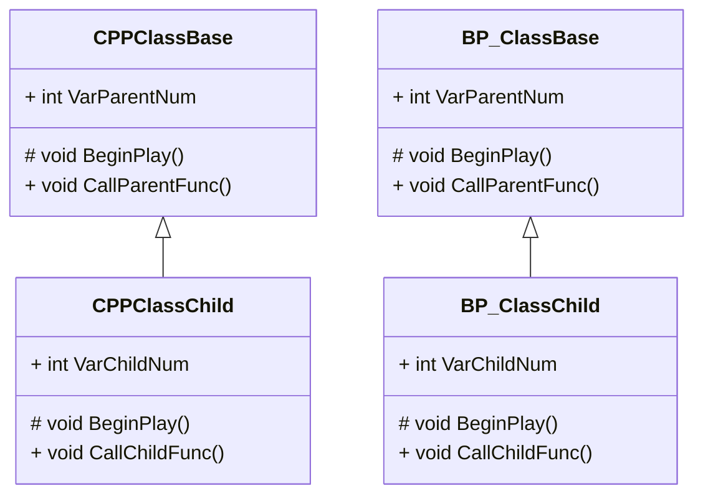
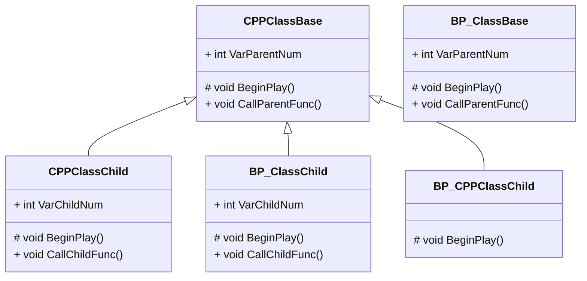
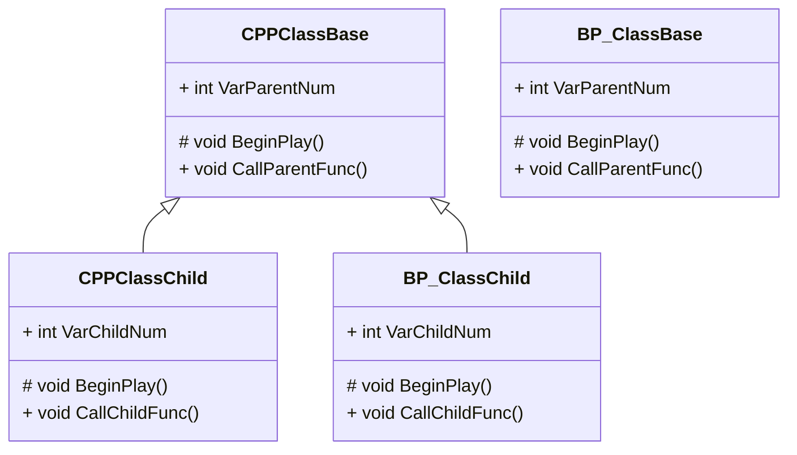

## 継承

### 継承について

BlueprintとC++で別々に基底クラスと派生クラスを作成しました。



「C++で作成した基底クラスをBPのクラスで継承する方法」や「継承先を変更する方法」について説明します。



### C++の基底クラスからBlueprintの派生クラスを作成する

C++の基底クラスからBlueprintの派生クラスを作成します。

ContentsBrowserの基底クラス「CPPClassBase」を右クリック > [Create Blueprint Class based on CPPClassBase]を選択します。


Nameにクラス名「BP_ClassChild」を設定します。
作成するフォルダを選択し、[Create Blueprint Class]ボタンをクリックします。


指定したフォルダに基底クラス「CPPClassBase」を継承したBlueprintが作成されます。


基底クラスに設定しているクラスはBlueprintEditorの右上に表示されます。
また「Class Settings」のParent Classプロパティで確認できます。


:::message
Blueprintの作成時に親クラスを選択する際にClass名を検索 > Class名を選択 > Select でもC++で作成したクラスを基底クラスに設定できます。


:::

### 基底クラスのBeginPlayを呼び出す

BeginPlayノードを右クリック > [Add call to parent function]を選択します。


[Parent：BeginPlay]ノードが追加されるので、接続します。


[Compile]ボタンをクリックします。


「BP_CPPClassChild」をViewportに配置します。
「BP_ClassChild」がある場合は削除します。


Level Editorの[Play]ボタンをクリックします。


C++の基底クラスのBeginPlayが呼ばれました。


呼ばれた処理の順序は以下の図になります。


[Parent：BeginPlay]ノードの接続を解除します。


[Compile]ボタンをクリックします。


Level Editorの[Play]ボタンをクリックします。


C++の基底クラスのBeginPlayが呼ばれました。


C++の基底クラスを継承した際には、[Parent：BeginPlay]ノードを接続しなくても基底クラスのBeginPlayが呼ばれます。


### 基底クラスのメンバ関数を呼び出す

基底クラスのメンバ関数「CallParentFunc」を呼び出します。

「Call Parent Func」で検索しても検索欄に見つかりません。


ヘッダファイルのメンバ関数を宣言している一行上に「UFUNCTION」の設定を追加します。

```cpp:CPPClassBase.h
	// 親クラスのメンバ関数
	UFUNCTION(BlueprintCallable, Category=CPP_And_Blueprint)
	void CallParentFunc();
```

ソースコードを保存して、Compileを実行します。


[CallParentFunc]を検索すると一覧に見つかるようになります。


[Parent：BeginPlay]ノードの接続を外し、[CallParentFunc]に接続します。


[Compile]ボタンをクリックします。


Level Editorの[Play]ボタンをクリックします。


CallParentFuncが呼ばれました。


しかし、実際にはBlueprint側のCallParentFuncが呼ばれておらず、C++の基底クラスのBeginPlayのCallParentFuncが呼ばれています。


### 基底クラスのデータメンバを変更する

基底クラスのデータメンバ「VarParentNum」を変更します。

基底クラスのデータメンバ「VarParentNum」を検索しても見つかりません。


C++の基底クラス「CPPClassBase」のデータメンバの一行上に「UPROPERTY」の設定を追加します。

```cpp:CPPClassBase.h
	// 親クラスのデータメンバ
	UPROPERTY(EditAnywhere, BlueprintReadWrite, Category=Default)
	int VarParentNum = 10;
```

ここからBeginPlayの処理が影響してきます。
この時のBeginPlayの処理は以下になります。

```cpp:CPPClassBase.cpp
// Called when the game starts or when spawned
void ACPPClassBase::BeginPlay()
{
	// 自分のメンバ関数を呼び出す
	CallParentFunc();
}
```

ソースコードを保存して、Compileを実行します。


基底クラスのデータメンバ[VarParentNum]のDefault値を変更したり、Set関数が呼び出せるようになります。


基底クラスのデータメンバ[VarParentNum]値を変更してから「CallParentFunc」を呼び出し、値が変更されたことを確認します。


[Compile]ボタンをクリックします。


Level Editorの[Play]ボタンをクリックします。


しかし、Setで設定した値が反映されていません。


基底クラスのBeginPlayを「Super::BeginPlay()」だけを呼び出すようにします。

```cpp:CPPClassBase.cpp
void ACPPClassBase::BeginPlay()
{
	Super::BeginPlay();

	// 自分のメンバ関数を呼び出す
	// CallParentFunc();
}
```

ソースコードを保存して、Compileを実行します。


Level Editorの[Play]ボタンをクリックします。


今回はSetで設定した値が反映されました。


基底クラスのBeginPlayで[CallParentFunc]を呼び出すようにします。

```cpp:CPPClassBase.cpp
void ACPPClassBase::BeginPlay()
{
	Super::BeginPlay();

	// 自分のメンバ関数を呼び出す
	CallParentFunc();
}
```

ソースコードを保存して、Compileを実行します。


Level Editorの[Play]ボタンをクリックします。


BlueprintとC++の両方で[CallParentFunc]が呼ばれました。


呼ばれた順番が分からないので、以下のようにCallParentFuncが呼ばれた後に設定を変更して、間にPrintStringを挟みます。


結果は、派生クラスのBeginePlayの処理が終わった後に、基底クラスのBeginPlayが呼ばれました。


以下の図のような処理順序になります。
C++の基底クラスを継承した際には、派生クラスの処理が終わった後に、基底クラスの処理が呼ばれます。


:::message
派生クラスの処理が上手く動かない時は、一度、基底クラスのBeginPlayでSuperだけを呼び出す状態でコンパイルをかけると動くようになるかもしれません。

```cpp:CPPClassBase.cpp
void ACPPClassBase::BeginPlay()
{
	Super::BeginPlay();

	// 自分のメンバ関数を呼び出す
	// CallParentFunc();
}
```
:::

### 継承した変数を表示する

Blueprintで継承したクラスの変数は表示されません。
しかし、継承したクラスの変数を表示することができます。
[My Blueprint]パネルの設定ボタンをクリック > [Show Inheited Variables]を選択します。


継承先の変数がVariablesカテゴリ内に表示されます。


### 継承先を変更する

Blueprint同士で継承していたClassを


継承先をC++の基底クラスに変更します。



「BP_ClassBase」を継承している「BP_ClassChild」の継承先をC++の基底クラス「CPPClassBase」に変更します。
「BP_ClassChild」を開きます。


[Class Settings]ボタンをクリックし、Parent Classを[CPPClassBase]に変更します。


[Reparent Blueprint]が表示されるので、[Reparent]ボタンをクリックします。


BeginPlayの処理を以下のように実装します。


「BP_CPPClassChild」を削除し、「BP_ClassChild」をViewportにDrag&Dropします。


基底クラスが変更され、C++の基底クラスの処理が呼ばれるようになりました。


Blueprintの基底クラスを継承した時と、C++の基底クラスを継承した時では処理が変わることを把握しておきましょう。


### 参照URL

https://docs.unrealengine.com/5.0/ja/cpp-and-blueprints-example/
