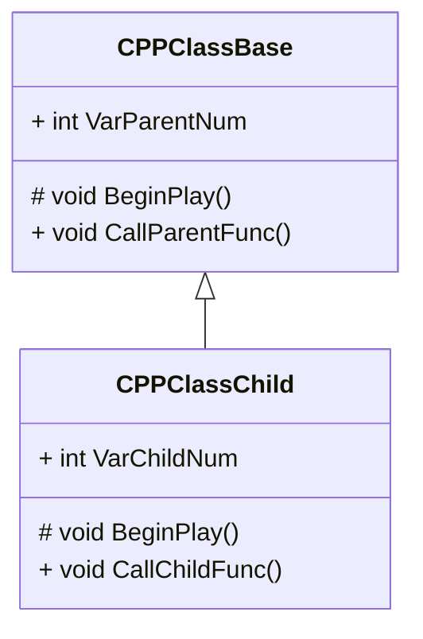

## 継承

ここからは基底クラスと派生クラスや他のクラスへのアクセスをしてクラスについて学んでいきます。

### 継承について

クラスのデータメンバやメンバ関数を引き継いだ派生クラスを作成することを**継承**と言います。
継承の元になったクラスのことを「**基底クラス**」、継承して作ったクラスのことを「**派生クラス**」といいます。
Unreal Engineでは親と子に例えて親クラス、子クラスと表示されます。

:::message
色んな言い方があります。

継承元	基本クラス、基底クラス、ベースクラス、スーパークラス、親クラス
継承先	派生クラス、サブクラス、子クラス
:::

### 基底クラス(親クラス)の作成

基底クラス(親クラス)を作成します。

[Tools]メニューから[New C++ Class]を開きます。


親クラスに[Actor]を選択します。


ClassTypeとClass名を設定します。

| Property   | Value        |
| ---------- | ------------ |
| Class Type | Public       |
| Name       | CPPClassBase |


```cpp:CPPClassBase.h
// Fill out your copyright notice in the Description page of Project Settings.

#pragma once

#include "CoreMinimal.h"
#include "GameFramework/Actor.h"
#include "CPPClassBase.generated.h"

UCLASS()
class CPP_BP_API ACPPClassBase : public AActor
{
	GENERATED_BODY()
	
public:	
	// Sets default values for this actor's properties
	ACPPClassBase();

protected:
	// Called when the game starts or when spawned
	virtual void BeginPlay() override;

public:
	// Scene Component
	UPROPERTY(EditAnywhere)
	USceneComponent* DefaultSceneRoot;

	// StaticMesh Component
	UPROPERTY(EditAnywhere)
	UStaticMeshComponent* StaticMesh;

	// 親クラスのメンバ関数 
	void CallParentFunc();

	// 親クラスのデータメンバ
	int VarParentNum = 10;
};
```

```cpp:CPPClassBase.cpp
// Fill out your copyright notice in the Description page of Project Settings.


#include "CPPClassBase.h"
#include "Kismet/KismetSystemLibrary.h"

// Sets default values
ACPPClassBase::ACPPClassBase()
{
	// SceneComponentをRootComponentに設定する。
	DefaultSceneRoot = CreateDefaultSubobject<USceneComponent>(TEXT("SceneComponent"));

	// SceneComponentをRootComponentに設定する
	RootComponent = DefaultSceneRoot;

	// StaticMeshComponentを作成する
	StaticMesh = CreateDefaultSubobject<UStaticMeshComponent>(TEXT("StaticMeshComponent"));

	// StaticMeshをLaodしてStaticMeshComponentのStaticMeshに設定する
	UStaticMesh* Mesh = LoadObject<UStaticMesh>(NULL, TEXT("/Game/CPP_BP/Meshes/SM_SampleCube"), NULL, LOAD_None, NULL);
	StaticMesh->SetStaticMesh(Mesh);

	// StaticMeshComponentをRootComponentにAttachする
	StaticMesh->SetupAttachment(RootComponent);
}

// Called when the game starts or when spawned
void ACPPClassBase::BeginPlay()
{
	Super::BeginPlay();
	
	CallParentFunc();
}

void ACPPClassBase::CallParentFunc()
{
    // Viewportに配置したActorの表示名を取得する
	FString name = UKismetSystemLibrary::GetDisplayName(this);
	
	// PrintStringでActor表示名,メンバ関数,データメンバを出力
	UKismetSystemLibrary::PrintString(this, FString::Printf(TEXT("%s : CallParentFunc %d"), *name, VarParentNum), true, true, FColor::Cyan, 10.f);
}
```

ソースコードを保存して、Compileを実行します。


「CPPClassBase」をViewportにDrag&Dropします。


Level Editorの[Play]ボタンをクリックします。


実装した処理が正しく処理されることを確認します。


### 派生クラス(子クラス)の作成

派生クラス(子クラス)を作成します。

[Tools]メニューから[New C++ Class]を開きます。


[All Classes]を選択して、親クラスを検索します。
親クラスに[CPPClassBase]を選択します。


ClassTypeとClass名を設定します。

| Property   | Value         |
| ---------- | ------------- |
| Class Type | Public        |
| Name       | CPPClassChild |


```cpp:CPPClassChild.h
// Fill out your copyright notice in the Description page of Project Settings.

#pragma once

#include "CoreMinimal.h"
#include "CPPClassBase.h"
#include "CPPClassChild.generated.h"

/**
 * 
 */
UCLASS()
class CPP_BP_API ACPPClassChild : public ACPPClassBase
{
	GENERATED_BODY()

public:
	ACPPClassChild();
	
protected:
	virtual void BeginPlay() override;

public:
	// 子クラスのメンバ関数 
	void CallChildFunc();

	// 子クラスのデータメンバ
	int VarChildNum = 100;
};
```

```cpp:CPPClassChild.cpp
// Fill out your copyright notice in the Description page of Project Settings.


#include "CPPClassChild.h"
#include "Kismet/KismetSystemLibrary.h"

ACPPClassChild::ACPPClassChild()
{
	// SphereをLaodしてStaticMeshComponentのStaticMeshに設定する
	UStaticMesh* Mesh = LoadObject<UStaticMesh>(NULL, TEXT("/Engine/BasicShapes/Sphere"), NULL, LOAD_None, NULL);
	StaticMesh->SetStaticMesh(Mesh);

	// MaterialをロードしてStaticMeshに設定する
	UMaterial* Material = LoadObject<UMaterial>(NULL, TEXT("/Game/CPP_BP/Materials/M_SampleMaterial"), NULL, LOAD_None, NULL);
	StaticMesh->SetMaterial(0, Material);
}

void ACPPClassChild::BeginPlay()
{
	Super::BeginPlay();

	CallChildFunc();
}

void ACPPClassChild::CallChildFunc()
{
	// Viewportに配置したActorの表示名を取得する
	FString name = UKismetSystemLibrary::GetDisplayName(this);

	// PrintStringでActor表示名と関数名を出力
	UKismetSystemLibrary::PrintString(this, FString::Printf(TEXT("%s : CallChildFunc %d"), *name, VarChildNum), true, true, FColor::Blue, 10.f);
}
```

クラスの継承はヘッダーファイルのクラス名のところでどのクラスを継承しているかを宣言します。

```cpp
UCLASS()
class CPP_BP_API ACPPClassChild : public ACPPClassBase

UCLASS()
class CPP_BP_API (派生クラス名) : public (基底クラス名)
```

ソースコードを保存して、Compileを実行します。


配置していた「CPPClassBase」を削除し、「CPPClassChild」をViewportに配置します。


Level Editorの[Play]ボタンをクリックします。


基底クラスと派生クラスのメンバ関数が呼び出されました。


### 派生クラスでできること

この時の派生クラスのBeginPlayの処理順序です。


```cpp
Super::BeginPlay();

// 基底クラスのメンバ関数を呼び出す
Super::メンバ関数()
```
Superについては「仮想関数とオーバーライド」の項目で説明します。

>ネイティブ コードでは、すべての UObject クラスは、その親クラスに設定されたカスタムの "Super" typedef を持ちます。これを使うとオーバーライドする挙動を簡単に制御することができます

https://docs.unrealengine.com/5.0/ja/unreal-object-handling/#%E3%83%A9%E3%83%B3%E3%82%BF%E3%82%A4%E3%83%A0%E6%99%82%E3%81%AE%E5%9E%8B%E6%83%85%E5%A0%B1

### 基底クラスのメンバ関数呼び出し

派生クラスは基底クラスの持つメンバ関数を呼び出すことができます。
Superで呼んでいたBeginePlayを消して、基底クラスで定義したメンバ関数を呼び出します。

```cpp
void ACPPClassChild::BeginPlay()
{
	// 基底クラスのメンバ関数を呼び出す
	CallParentFunc();

	// 自分が持っているメンバ関数を呼び出す
	CallChildFunc();
}
```

ソースコードを保存して、Compileを実行します。


Level Editorの[Play]ボタンをクリックします。


基底クラスのメンバ関数が呼び出せました。


### 基底クラスのデータメンバの変更

派生クラスは基底クラスのデータメンバを変更できます。
基底クラスのデータメンバを変更します。

```cpp
void ACPPClassChild::BeginPlay()
{
	// 親クラスのデータメンバを変更する
	VarParentNum = 1000;

	// 親クラスのメンバ関数を呼び出す
	CallParentFunc();

	// 自分が持っているメンバ関数を呼び出す
	CallChildFunc();
}
```
ソースコードを保存して、Compileを実行します。


Level Editorの[Play]ボタンをクリックします。


基底クラスのデータメンバの値を変更できました。


### 基底クラスからは派生クラスで定義したデータメンバ、メンバ関数は使用できない

基底クラスのBeginPlayで派生クラスのデータメンバを変更し、メンバ関数を呼び出す処理を書きます。

```cpp
void ACPPClassBase::BeginPlay()
{
	// 親クラスのデータメンバを変更する
	VarChildNum = 1000;

	// 自分のメンバ関数を呼び出す
	CallParentFunc();

	// 派生クラスが持っているメンバ関数を呼び出す
	CallChildFunc();
}
```

基底クラスでは派生クラスのデータメンバ、メンバ関数は見つからずコンパイルでエラーになります。

```
CPP_BP\Source\CPP_BP\Private\CPPClassBase.cpp(31): error C2065: 'VarChildNum': undeclared identifier
CPP_BP\Source\CPP_BP\Private\CPPClassBase.cpp(37): error C3861: 'CallChildFunc': identifier not found
```

ZennではmermaidでUMLのクラス図を書くことができるので、基底クラスと派生クラスをクラス図にします。

https://lecture.ecc.u-tokyo.ac.jp/~hideo-t/references/uml/class-diagram/class-diagram.html



派生クラスは基底クラスのデータメンバーやメンバ関数を含めることができますが、基底クラスは派生クラスのデータメンバやメンバ関数を含めることはできません。


### ソースコード

https://github.com/posita33/UE5Starter-CPPAndBP_Projects/blob/main/Resources/Chapter_03/Inheritance/Public/CPPClassBase.h

https://github.com/posita33/UE5Starter-CPPAndBP_Projects/blob/main/Resources/Chapter_03/Inheritance/Private/CPPClassBase.cpp

https://github.com/posita33/UE5Starter-CPPAndBP_Projects/blob/main/Resources/Chapter_03/Inheritance/Public/CPPClassChild.h

https://github.com/posita33/UE5Starter-CPPAndBP_Projects/blob/main/Resources/Chapter_03/Inheritance/Private/CPPClassChild.cpp
