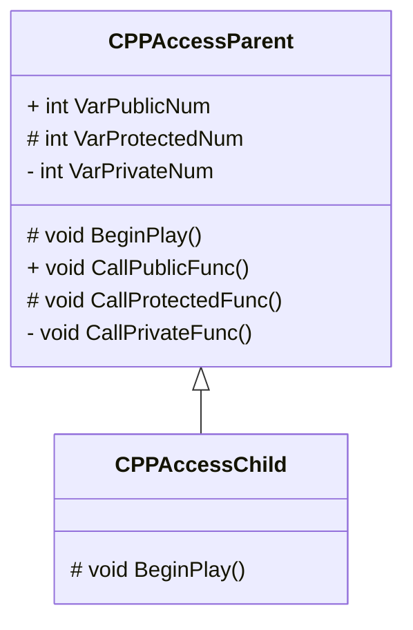
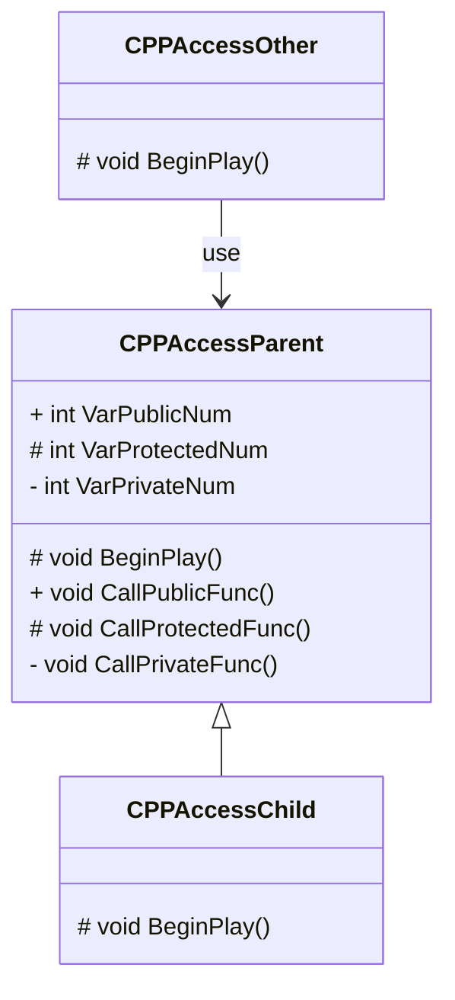

## アクセス指定子

### アクセス指定子について

継承した派生したクラスが基底クラスのデータメンバやメンバ関数を使用できました。
アクセス指定子によってメンバを参照できる範囲を制限できます。
アクセス指定子には次の3種類があります。

| アクセス指定子 | 自クラス | 継承したクラス | 外部クラス |
| -------------- | -------- | -------------- | ---------- |
| public         | 〇       | 〇             | 〇         |
| protected      | 〇       | 〇             | ×          |
| private        | 〇       | ×              | ×          |

C++で3つのアクセス指定子の使用方法や参照できる範囲を把握してみます。

### 基底クラス（親クラス）を作成する

基底クラス(親クラス)を作成します。

[Tools]メニューから[New C++ Class]を開きます。


親クラスに[Actor]を選択します。


ClassTypeとClass名を設定します。

| Property   | Value           |
| ---------- | --------------- |
| Class Type | Public          |
| Name       | CPPAccessParent |


ヘッダファイルに3種類のアクセス指定子のデータメンバとメンバ関数を定義します。

```cpp:CPPAccessParent.h
// Fill out your copyright notice in the Description page of Project Settings.

#pragma once

#include "CoreMinimal.h"
#include "GameFramework/Actor.h"
#include "CPPAccessParent.generated.h"

UCLASS()
class CPP_BP_API ACPPAccessParent : public AActor
{
	GENERATED_BODY()
	
protected:
	// Called when the game starts or when spawned
	virtual void BeginPlay() override;

public:
	
	// 親クラスのメンバ関数(Public)
	void CallPublicFunc();

	// 親クラスのデータメンバ(Public)
	int VarPublicNum = 10;

protected:

	// 親クラスのメンバ関数(Protected)
	void CallProtectedFunc();

	// 親クラスのデータメンバ(Protected)
	int VarProtectedNum = 20;

private:

	// 親クラスのメンバ関数(Private)
	void CallPrivateFunc();

	// 親クラスのデータメンバ(Private)
	int VarPrivateNum = 30;
};

```

```cpp:CPPAccessParent.cpp
// Fill out your copyright notice in the Description page of Project Settings.


#include "CPPAccessParent.h"
#include "Kismet/KismetSystemLibrary.h"

// Called when the game starts or when spawned
void ACPPAccessParent::BeginPlay()
{
	Super::BeginPlay();
	
	// Public関数の呼び出し
	CallPublicFunc();

	// Protected関数の呼び出し
	CallProtectedFunc();

	// Private関数の呼び出し
	CallPrivateFunc();
}

void ACPPAccessParent::CallPublicFunc()
{
	// Viewportに配置したActorの表示名を取得する
	FString name = UKismetSystemLibrary::GetDisplayName(this);

	// PrintStringでActor表示名,メンバ関数,データメンバを出力
	UKismetSystemLibrary::PrintString(this, FString::Printf(TEXT("%s : CallPublicFunc %d"), *name, VarPublicNum), true, true, FColor::Cyan, 10.f);
}

void ACPPAccessParent::CallProtectedFunc()
{
	// Viewportに配置したActorの表示名を取得する
	FString name = UKismetSystemLibrary::GetDisplayName(this);

	// PrintStringでActor表示名,メンバ関数,データメンバを出力
	UKismetSystemLibrary::PrintString(this, FString::Printf(TEXT("%s : CallProtectedFunc %d"), *name, VarProtectedNum), true, true, FColor::Cyan, 10.f);
}

void ACPPAccessParent::CallPrivateFunc()
{
	// Viewportに配置したActorの表示名を取得する
	FString name = UKismetSystemLibrary::GetDisplayName(this);

	// PrintStringでActor表示名,メンバ関数,データメンバを出力
	UKismetSystemLibrary::PrintString(this, FString::Printf(TEXT("%s : CallPrivateFunc %d"), *name, VarPrivateNum), true, true, FColor::Cyan, 10.f);
}


```
ソースコードを保存して、Compileを実行します。


「CPPAccessParent」をViewportにDrag&Dropします。


Level Editorの[Play]ボタンをクリックします。


自クラスはアクセス指定子が異なっていても、すべてのメンバ関数とデータメンバにアクセスできます。


### 派生クラス（子クラス）を作成する

基底クラスから派生クラスを作成します。
基底クラス「CPPAccessParent」を右クリック > [Create C++ Class derived from CPPAccessParent]を選択します。


ClassTypeとClass名を設定します。

| Property   | Value          |
| ---------- | -------------- |
| Class Type | Public         |
| Name       | CPPAccessChild |


派生クラスでBeginPlayをSuperを使用して親クラスのBeginPlayの処理を呼び出します。

```cpp:CPPAccessChild.h
// Fill out your copyright notice in the Description page of Project Settings.

#pragma once

#include "CoreMinimal.h"
#include "CPPAccessParent.h"
#include "CPPAccessChild.generated.h"

/**
 * 
 */
UCLASS()
class CPP_BP_API ACPPAccessChild : public ACPPAccessParent
{
	GENERATED_BODY()

protected:
	// Called when the game starts or when spawned
	virtual void BeginPlay() override;
};

```

```cpp:CPPAccessChild.h
// Fill out your copyright notice in the Description page of Project Settings.


#include "CPPAccessChild.h"

void ACPPAccessChild::BeginPlay()
{
	Super::BeginPlay();
}

```

ソースコードを保存して、Compileを実行します。


「CPPAccessParent」を削除します。
「CPPAccessChild」をViewportにDrag&Dropします。


Level Editorの[Play]ボタンをクリックします。


Super経由では親クラスのデータメンバ、メンバ関数の処理が呼べます。


次に、Super経由ではなく、基底クラスのデータメンバ、メンバ関数を参照します。

```cpp:CPPAccessChild.cpp
void ACPPAccessChild::BeginPlay()
{
	// Super::BeginPlay();

	// データメンバ(Public)を変更する
	VarPublicNum = 100;

	// データメンバ(Protected)を変更する
	VarProtectedNum = 200;

	// データメンバ(Private)を変更する
	VarPrivateNum = 300;

	// 基底クラスのメンバ関数(Public)を呼び出す
	CallPublicFunc();

	// 基底クラスのメンバ関数(Protected)を呼び出す
	CallProtectedFunc();

	// 基底クラスのメンバ関数(Private)を呼び出す
	CallPrivateFunc();
}

```

ソースコードを保存して、Compileを実行します。


Privateで宣言した、[VarPrivateParent],[CallPrivateFunc]でエラーが発生してコンパイルに失敗します。

```
CPP_BP\Private\CPPAccessChild.cpp(17): error C2248: 'ACPPAccessParent::VarPrivateNum': cannot access private member declared in class 'ACPPAccessParent'
CPP_BP\Public\CPPAccessParent.h(40): note: see declaration of 'ACPPAccessParent::VarPrivateNum'
CPP_BP\Public\CPPAccessParent.h(10): note: see declaration of 'ACPPAccessParent'
CPP_BP\Private\CPPAccessChild.cpp(26): error C2248: 'ACPPAccessParent::CallPrivateFunc': cannot access private member declared in class 'ACPPAccessParent'
CPP_BP\Public\CPPAccessParent.h(37): note: see declaration of 'ACPPAccessParent::CallPrivateFunc'
CPP_BP\Public\CPPAccessParent.h(10): note: see declaration of 'ACPPAccessParent'
Build failed.
```

Privateのデータメンバ、メンバ関数をコメントアウトします。

```cpp:CPPAccessChild.cpp
void ACPPAccessChild::BeginPlay()
{
	// Super::BeginPlay();

	// データメンバ(Public)を変更する
	VarPublicNum = 100;

	// データメンバ(Protected)を変更する
	VarProtectedNum = 200;

	// データメンバ(Private)を変更する
	// VarPrivateNum = 300;

	// 基底クラスのメンバ関数(Public)を呼び出す
	CallPublicFunc();

	// 基底クラスのメンバ関数(Protected)を呼び出す
	CallProtectedFunc();

	// 基底クラスのメンバ関数(Private)を呼び出す
	// CallPrivateFunc();
}
```
ソースコードを保存して、Compileを実行します。


Level Editorの[Play]ボタンをクリックします。


派生クラスからはPublicとProtectedで宣言したデータメンバ、メンバ関数を参照できます。


クラス図で書くと以下のようになります。



クラス図の先頭の記号はアクセス指定子を表します。

| アクセス指定子 | 記号 |
| -------------- | ---- |
| public         | +    |
| protected      | #    |
| private        | -    |

派生クラスから基底クラスのデータメンバ、メンバ関数の参照については以下のような図の範囲になります。


### 外部クラスから呼び出す

基底クラスのアクセス指定子を外部クラスから参照するための外部クラスを作成します。

[Tools]メニューから[New C++ Class]を開きます。


親クラスに[Actor]を選択します。


ClassTypeとClass名を設定します。

| Property   | Value          |
| ---------- | -------------- |
| Class Type | Public         |
| Name       | CPPAccessOther |


CPPAccessParentをViewportから取得し、CPPAccessParentのデータメンバ、メンバ関数に外部関数から参照する処理を実装します。

```cpp:CPPAccessOther.h
// Fill out your copyright notice in the Description page of Project Settings.

#pragma once

#include "CoreMinimal.h"
#include "GameFramework/Actor.h"
#include "CPPAccessOther.generated.h"

UCLASS()
class CPP_BP_API ACPPAccessOther : public AActor
{
	GENERATED_BODY()
	
protected:
	// Called when the game starts or when spawned
	virtual void BeginPlay() override;

};

```

```cpp:CPPAccessOther.cpp
// Fill out your copyright notice in the Description page of Project Settings.


#include "CPPAccessOther.h"
#include "CPPAccessParent.h"
#include "Kismet/GameplayStatics.h"

// Called when the game starts or when spawned
void ACPPAccessOther::BeginPlay()
{
	Super::BeginPlay();

	// ViewportにあるACPPAccessParentを探す
	AActor* FoundActor = UGameplayStatics::GetActorOfClass(GetWorld(),ACPPAccessParent::StaticClass());

	// 取得したAActorからACPPAccessParentに変換する 
	ACPPAccessParent* CPPAccessParent = Cast<ACPPAccessParent>(FoundActor);

	// CPPAccessParentのデータメンバ(Public)を変更する
	CPPAccessParent->VarPublicNum = 1000;

	// CPPAccessParentのデータメンバ(Protected)を変更する
	CPPAccessParent->VarProtectedNum = 2000;

	// CPPAccessParentのデータメンバ(Private)を変更する
	CPPAccessParent->VarPrivateNum = 3000;

	// CPPAccessParentのメンバ関数(Public)を呼び出す
	CPPAccessParent->CallPublicFunc();

	// CPPAccessParentのメンバ関数(Protected)を呼び出す
	CPPAccessParent->CallProtectedFunc();

	// CPPAccessParentのメンバ関数(Private)を呼び出す
	CPPAccessParent->CallPrivateFunc();
}

```

PrintStringの出力を確認しやすくするために、CPPAccessParentのメンバ関数の呼び出し処理をコメントアウトします。

```cpp:CPPAccessParent.cpp
void ACPPAccessParent::BeginPlay()
{
	Super::BeginPlay();
	
	// Public関数の呼び出し
	// CallPublicFunc();

	// Protected関数の呼び出し
	// CallProtectedFunc();

	// Private関数の呼び出し
	// CallPrivateFunc();
}
```

ソースコードを保存して、Compileを実行します。


外部クラスからは基底クラスCPPAccessParentのProtected、Privateで宣言したデータメンバ、メンバ関数の参照はエラーになりコンパイルが失敗します。

```
CPP_BP\Private\CPPAccessOther.cpp(23): error C2248: 'ACPPAccessParent::VarProtectedNum': cannot access protected member declared in class 'ACPPAccessParent'
CPP_BP\Public\CPPAccessParent.h(32): note: see declaration of 'ACPPAccessParent::VarProtectedNum'
CPP_BP\Public\CPPAccessParent.h(10): note: see declaration of 'ACPPAccessParent'
CPP_BP\Private\CPPAccessOther.cpp(26): error C2248: 'ACPPAccessParent::VarPrivateNum': cannot access private member declared in class 'ACPPAccessParent'
CPP_BP\Public\CPPAccessParent.h(40): note: see declaration of 'ACPPAccessParent::VarPrivateNum'
CPP_BP\Public\CPPAccessParent.h(10): note: see declaration of 'ACPPAccessParent'
CPP_BP\Private\CPPAccessOther.cpp(32): error C2248: 'ACPPAccessParent::CallProtectedFunc': cannot access protected member declared in class 'ACPPAccessParent'
CPP_BP\Public\CPPAccessParent.h(29): note: see declaration of 'ACPPAccessParent::CallProtectedFunc'
CPP_BP\Public\CPPAccessParent.h(10): note: see declaration of 'ACPPAccessParent'
CPP_BP\Private\CPPAccessOther.cpp(35): error C2248: 'ACPPAccessParent::CallPrivateFunc': cannot access private member declared in class 'ACPPAccessParent'
CPP_BP\Public\CPPAccessParent.h(37): note: see declaration of 'ACPPAccessParent::CallPrivateFunc'
CPP_BP\Public\CPPAccessParent.h(10): note: see declaration of 'ACPPAccessParent'
```

基底クラスCPPAccessParentのProtected、Privateで宣言したデータメンバ、メンバ関数の参照処理をコメントアウトします。

```cpp:CPPAccessOther.cpp
void ACPPAccessOther::BeginPlay()
{
	Super::BeginPlay();

	// ViewportにあるACPPAccessParentを探す
	AActor* FoundActor = UGameplayStatics::GetActorOfClass(GetWorld(),ACPPAccessParent::StaticClass());

	// 取得したAActorからACPPAccessParentに変換する 
	ACPPAccessParent* CPPAccessParent = Cast<ACPPAccessParent>(FoundActor);

	// CPPAccessParentのデータメンバ(Public)を変更する
	CPPAccessParent->VarPublicNum = 1000;

	// CPPAccessParentのデータメンバ(Protected)を変更する
	// CPPAccessParent->VarProtectedNum = 2000;

	// CPPAccessParentのデータメンバ(Private)を変更する
	// CPPAccessParent->VarPrivateNum = 3000;

	// CPPAccessParentのメンバ関数(Public)を呼び出す
	CPPAccessParent->CallPublicFunc();

	// CPPAccessParentのメンバ関数(Protected)を呼び出す
	// CPPAccessParent->CallProtectedFunc();

	// CPPAccessParentのメンバ関数(Private)を呼び出す
	// CPPAccessParent->CallPrivateFunc();
}

```

ソースコードを保存して、Compileを実行します。


Viewportの「CPPAccessChild」を削除します。
Viewportに「CPPAccessParent」と「CPPAccessOther」をDrag&Dropします。


Level Editorの[Play]ボタンをクリックします。


外部クラスからは基底クラス「CPPAccessParent」のPublicで宣言したデータメンバ、メンバ関数しか参照できません。


外部クラスから基底クラスのデータメンバ、メンバ関数の参照については以下のような図になります。



外部クラスからはPublicで宣言したデータメンバとメンバ関数にしか参照できません。


### アクセス指定子の参照範囲について

アクセス指定子の参照範囲については以下の表と図を覚えておきましょう。

| アクセス指定子 | 自クラス | 継承したクラス | 外部クラス |
| -------------- | -------- | -------------- | ---------- |
| public         | 〇       | 〇             | 〇         |
| protected      | 〇       | 〇             | ×          |
| private        | 〇       | ×              | ×          |


## ソースコード

https://github.com/posita33/UE5Starter-CPPAndBP_Projects/blob/main/Resources/Chapter_03/AccessSpecifier/Public/CPPAccessParent.h

https://github.com/posita33/UE5Starter-CPPAndBP_Projects/blob/main/Resources/Chapter_03/AccessSpecifier/Private/CPPAccessParent.cpp

https://github.com/posita33/UE5Starter-CPPAndBP_Projects/blob/main/Resources/Chapter_03/AccessSpecifier/Public/CPPAccessChild.h

https://github.com/posita33/UE5Starter-CPPAndBP_Projects/blob/main/Resources/Chapter_03/AccessSpecifier/Private/CPPAccessChild.cpp

https://github.com/posita33/UE5Starter-CPPAndBP_Projects/blob/main/Resources/Chapter_03/AccessSpecifier/Public/CPPAccessParent.h

https://github.com/posita33/UE5Starter-CPPAndBP_Projects/blob/main/Resources/Chapter_03/AccessSpecifier/Private/CPPAccessOther.cpp
